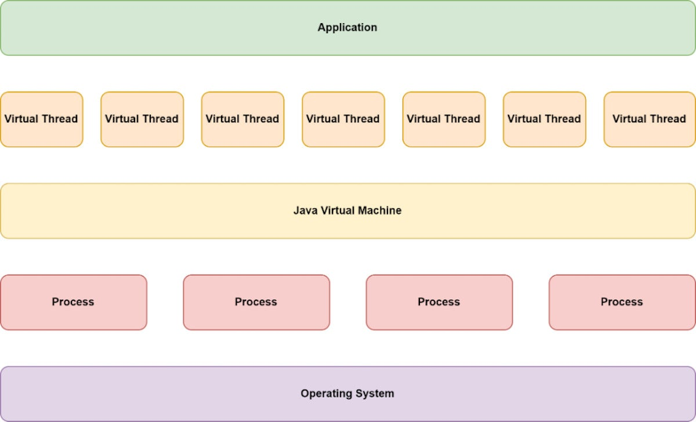

# Learn Java 20

## Prerequisite

- JDK 20
- Maven

## Overview

__How virtual threads work__

Virtual threads introduce an abstraction layer between operating-system processes and application-level concurrency. Said differently, virtual threads can be used to schedule tasks that the Java virtual machine orchestrates, so the JVM mediates between the operating system and the program. Figure 1 shows the architecture of virtual threads.



Ref: https://www.infoworld.com/article/3678148/intro-to-virtual-threads-a-new-approach-to-java-concurrency.html


## Build and Run

```
mvn compile exec:java

# or
mvn clean package
java --enable-preview -cp target/learn-java20-1.0-SNAPSHOT.jar org.example.App
```

```
Using vThreads: false
   Start: Sat Mar 25 22:12:40 ICT 2023
Run time: 11080 ms.
     End: Sat Mar 25 22:12:51 ICT 2023
--------------------------------------------------------------------------------
Using vThreads: true
   Start: Sat Mar 25 22:12:51 ICT 2023
Run time: 98 ms.
     End: Sat Mar 25 22:12:51 ICT 2023
```

## Notes

- [How to Enable Java Preview Features and Run Code from IntelliJ IDEA](https://foojay.io/today/how-to-run-project-loom-from-intellij-idea/)
